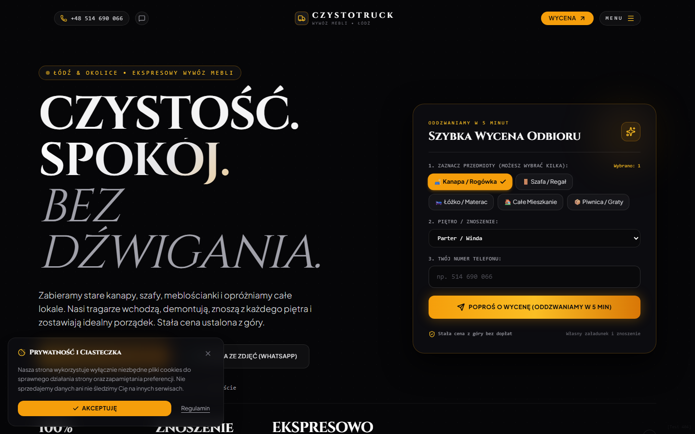
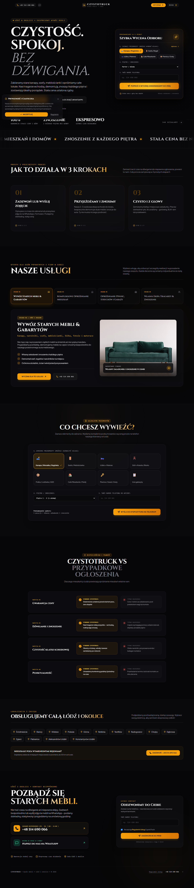

# 🚛 CzystoTruck • Wywóz Mebli & Opróżnianie Mieszkań (Łódź)

> Ekskluzywna, wysoce zoptymalizowana strona internetowa dla łódzkiej marki **CzystoTruck**, stworzona w duchu estetyki **Forge Automotive (Dark Luxury)** z pełną automatyzacją powiadomień na komunikator **Telegram**.



---

## 🌟 Główne Cechy Projektu

- **💎 Stylistyka Dark Luxury & Industrial:**
  Głęboka, aksamitna czerń (`#060608`), szczotkowany grafit, stal oraz szlachetny akcent bursztynowego złota (`#f59e0b`).
- **🏛️ Monumentalna Typografia:**
  Szeryfowy, wyrazisty krój nagłówkowy **Cinzel** połączony z czytelnym i nowoczesnym fontem **Plus Jakarta Sans**.
- **⚡ Interaktywny Panel Szybkiej Wyceny w Hero:**
  Klient może jednym kliknięciem zaznaczyć **wiele przedmiotów naraz** (*Kanapa / Rogówka, Szafa / Regał, Łóżko / Materac, Całe Mieszkanie, Piwnica*), określić piętro i wysłać numer telefonu z obietnicą oddzwonienia w 5 minut.
- **📱 Bezpośrednia Integracja z Botem Telegram:**
  Każde zgłoszenie klienta ze strony, kalkulatora lub kliknięcie w numer telefonu trafia **natychmiast jako powiadomienie na prywatny telefon właściciela** przez Telegram Bot API.
- **🔒 Dyskrecja Technologiczna:**
  Wszelkie odnośniki administracyjne Telegrama zostały ukryte przed klientami. Właściciel może otworzyć panel konfiguracji **potrójnym kliknięciem w logo z ciężarówką** w nagłówku lub dyskretną kropką w stopce.
- **🎡 Automatyczny Pasek Marquee:**
  Poziomy ticker z hasłami i dzielnicami Łodzi ślizga się w 100% samoczynnie ze stałą prędkością 60 fps bez konieczności dotykania myszki.
- **🛋️ Interaktywny Kalkulator Mebli:**
  Wizualna lista kafelków meblowych z wyborem znoszenia z każdego piętra i bezpośrednią wysyłką do dyspozytora.
- **🛡️ Sekcja Zaufania "CzystoTruck vs Przypadkowe Ogłoszenia":**
  Zestawienie eliminujące obawy klientów: stała cena ustalona z góry, własny załadunek i znoszenie przez tragarzy, dbałość o czystość klatek i punktualność.
- **📍 Lokalny Zasięg w Łodzi:**
  Interaktywna lista wszystkich dzielnic i osiedli Łodzi (*Bałuty, Widzew, Śródmieście, Polesie, Górna, Retkinia, Zgierz, Pabianice itd.*).
- **💾 100% Samodzielna Wersja Offline (Singlefile):**
  Stronę można otworzyć bezpośrednio dwuklikiem z dysku w pliku `CzystoTruck-Strona.html` bez konieczności instalowania Node.js czy uruchamiania serwera.

---

## 📸 Pełny Podgląd Strony



---

## 🛠️ Stack Technologiczny

| Technologia | Przeznaczenie |
| :--- | :--- |
| **React 18** | Reaktywny interfejs użytkownika i zarządzanie stanem |
| **Vite 5** | Błyskawiczne środowisko deweloperskie i optymalizator bundli |
| **Tailwind CSS 3** | Utility-first system stylizacji z dedykowaną ciemną paletą |
| **GSAP (ScrollTrigger)** | Zaawansowane animacje przejść i płynne wejścia |
| **Lenis** | Płynny silnik przewijania z zachowaniem natywnego dotyku na mobile |
| **Lucide Icons** | Nowoczesny zestaw wektorowych ikon UI |
| **Canvas Confetti** | Efekt gratulacyjny po wysłaniu formularza wyceny |
| **Telegram Bot API** | Natychmiastowe powiadomienia push o leadach na telefon |
| **Vite Plugin Singlefile** | Kompilacja całego projektu do jednego pliku HTML offline |
| **Playwright** | Zautomatyzowany audyt poprawności i testy renderowania |

---

## 📁 Struktura Projektu

```
d:\antigravity\work website\
├── CzystoTruck-Strona.html   # Samodzielna wersja offline (otwórz dwuklikiem!)
├── Uruchom-Strone.bat        # Skrypt wsadowy do uruchomienia serwera 1 kliknięciem
├── index.html                # Główny szablon z inteligentnym przekierowaniem
├── vite.config.js            # Konfiguracja Vite + SingleFile bundle
├── tailwind.config.js        # Konfiguracja kolorów Dark Luxury i fontów
├── docs/                     # Zrzuty ekranu do dokumentacji
└── src/
    ├── main.jsx              # Punkt wejścia React
    ├── index.css             # Style bazowe, Lenis i animacja Marquee
    ├── App.jsx               # Główny komponent łączący sekcje
    ├── data/
    │   └── content.json      # Centralny plik z tekstami, telefonami i danymi
    ├── services/
    │   └── telegramService.js # Moduł integracji z API bota Telegram
    ├── hooks/
    │   └── useSmoothScroll.js # Obsługa płynnego przewijania Lenis
    └── components/
        ├── Preloader.jsx            # Ekran ładowania 0-100% z monogramem
        ├── Header.jsx               # Minimalistyczny nagłówek z tajnym dostępem
        ├── HeroSection.jsx          # Monumentalny nagłówek + panel wyceny
        ├── MarqueeSection.jsx       # Samobieżny pasek tickerowy 60fps
        ├── HowItWorksSection.jsx    # 3 proste kroki realizacji
        ├── ServicesSection.jsx      # Interaktywny showcase usług z tabami
        ├── FurnitureCalculator.jsx  # Wizualny kalkulator mebli
        ├── ComparisonSection.jsx    # Porównanie standardów CzystoTruck
        ├── DistrictsSection.jsx     # Mapa osiedli i rejonów Łodzi
        ├── ContactSection.jsx       # Strefa bezpośredniego telefonu i oddzwonienia
        ├── StoryDrawer.jsx          # Panel boczny z historią firmy i flotą
        ├── TermsModal.jsx           # Regulamin usług z płynnym scrollem
        ├── TelegramModal.jsx        # Panel testowy bota Telegram dla właściciela
        ├── CookieBanner.jsx         # Dyskretny baner zgody na cookies
        ├── MobileCallBar.jsx        # Pływający przycisk szybkiego telefonu na smartfony
        └── NotFoundPage.jsx         # Customowa strona błędu 404
```

---

## 🚀 Uruchomienie i Instalacja

### Opcja 1: Najprostsza (bez terminala)
Kliknij dwukrotnie w plik:
📁 **`CzystoTruck-Strona.html`** – strona uruchomi się natychmiast w Twojej domyślnej przeglądarce.

### Opcja 2: Przez serwer lokalny (zalecana podczas edycji)
Kliknij dwukrotnie w plik:
📁 **`Uruchom-Strone.bat`** – uruchomi on serwer i automatycznie otworzy adres `http://localhost:3000/`.

Lub wpisz w terminalu:
```bash
npm install
npm run dev
```

### Opcja 3: Budowanie wersji produkcyjnej
```bash
npm run build
```
Wynik kompilacji znajdziesz w katalogu `dist/index.html` oraz `CzystoTruck-Strona.html`.

---

## 📲 Konfiguracja Bota Telegram (dla Właściciela)

Powiadomienia ze strony przychodzą bezpośrednio na Twój telefon w aplikacji Telegram. Aby je aktywować w 2 minuty:

1. W Telegramie wyszukaj bota **`@BotFather`** i wyślij komendę `/newbot`.
2. Nadaj botowi nazwę (np. *CzystoTruck Leads*) i skopiuj wygenerowany **Token** (np. `123456789:ABCdef...`).
3. Wyszukaj w Telegramie bota **`@userinfobot`** i kliknij *Start* – skopiuj swoje numeryczne **Chat ID**.
4. Na stronie kliknij **3 razy w logo z ciężarówką** w nagłówku, wklej oba parametry i kliknij **"Wyślij test na mój telefon"**.
5. Gotowe! Od teraz każde zapytanie klienta natychmiast zawibruje na Twoim telefonie.

---

## ✏️ Jak Edytować Treści i Numery Telefonów?

Wszystkie dane na stronie są odseparowane od kodu logiki. Aby zmienić numer telefonu, teksty lub ofertę, wystarczy wyedytować plik:
👉 **`src/data/content.json`**

- Zmiana numeru telefonu: `company.phone` oraz `company.phoneRaw`.
- Zmiana godzin dyspozycyjności: `company.hours`.
- Zmiana opisu usług: tablica `services`.
- Zmiana dzielnic Łodzi: tablica `districts`.

---

## 📄 Licencja

Projekt stworzony na wyłączność dla marki **CzystoTruck**. Wszelkie prawa zastrzeżone.
